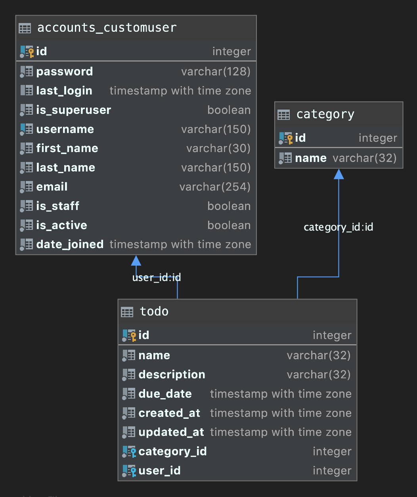

== 目次
. PyCharmでプロジェクト開始するまで
. データベースを準備
.. docker-compose
.. PostgreSQL、MySQL
. Bootstrap5で画面作成

== （1）PyCharmでプロジェクト開始するまで
=== 【プロジェクト開始の準備】

|===
|操作内容|操作 |説明

|①python3のインストール
|$ brew install python3
|バージョン確認：$ python3 --version

|② anacondaインストール
|https://www.anaconda.com/products/individual
|* PyCharm（インタプリタ）の設定

|③pipのインストール、アップデート
|$curl 'https://bootstrap.pypa.io/get-pip.py -o get-pip.py' +
 $python3 get-pip.py
|バージョン確認：$ pip --version

|④Djangoをインストール, Update
|$ python -m django --version
|バージョン確認：Pythonコンソールを起動して +

|⑤仮想環境を作成、アクティベートする
|$ python3 -m venv venv +
 $ cd venv/bin +
 $ source ./activate
| ターミナルの表示の先頭に、(venv)が表示される。

|⑥PyCharmのインストール
|https://www.jetbrains.com/ja-jp/pycharm/
|*

|⑦PyCharmでDjangoプロジェクトの作成
|[メニュー]新規プロジェクトの作成 +
Djangoを選択、作成する。
|*

|⑧settings.pyのTEMPLATESのDIRを変更し、アプリを起動する。
|        # 'DIRS': [BASE_DIR / 'templates'], +
        'DIRS': [os.path.join(BASE_DIR, 'templates')],
|← DIRSの行をコメントにし、その下の行に変更、▶で実行、 +
   初期画面が表示されれば、OK。

|⑨ .gitignoreファイルを作成する。
|(メニュー)ファイル→新規→.ignore file→.gitignore fire +
 → .gitignore(Git)を選択、pythonを選択し、ファイル作成する。
|*

|⑩データベースのドライバーをインストールする。
|PostgreSQL: $ pip install psycopg2-binary +
 MySQL： 後出
|*
|===
・インストールソフト・バージョンの確認
[source, bash]
pip freeze # インストールソフト確認
pip list -o # アップグレードすべきソフトの一覧
pip install -U <ソフト> # ソフトウェアのアップグレード

=== Lesson-1 Todoアプリ開発
== 作成画面

== 画面遷移図
(*)プログラム上では、Update→Detailに変更しました。

== Todoテーブル

== テーブル一覧
image::static/images/django_all_tables.png[]
